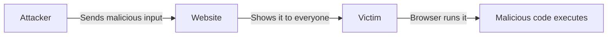

# Cross-site scripting

> **📖 Docs:** [Index](../README.md) · [User Guide](../USER_GUIDE.md) · [All Stages](../stages/stages.md) · [Attack Synthesis](attack_synthesis.md)

Cross-site scripting which can also written like XSS, is a type of web security vulnerability that injects malicious scripts into trusted websites. Attackers using XSS can perform some of the following:

* Impersonate users
* Steal login credentials
* Modify pages to show falsified forms and attacted links 
* Trick users into performing performing actions unbeknownst to them

